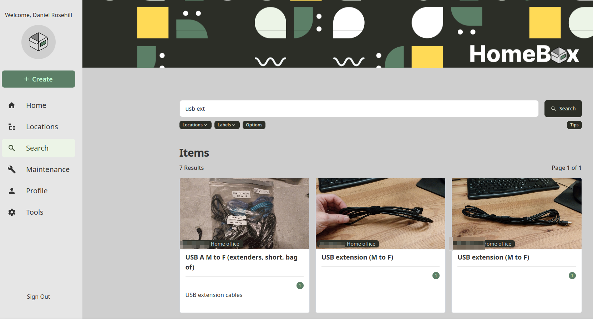
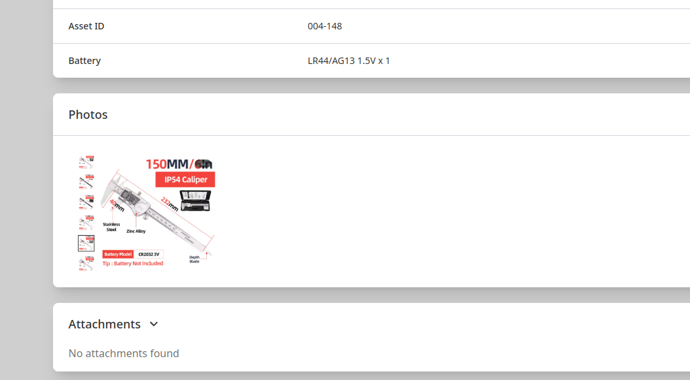

# My Homebox Development Ideas

 ## Repo Purpose

I'm a huge fan of the [Homebox](https://github.com/sysadminsmedia/homebox) home inventory management system. 

Once upon a time, I had so many random tech belongings that it was quicker for me to buy something new than to find it in my crazy collection of boxes.  Not only was this an unjustifiable waste of money, it also made me feel terrible about how much unnecessary e-waste I was generating in the process. 

Homebox was my version of reaching for the nuclear option. Over time, it also became a test of perseverence: cataloging over 4,000 items was a massive undertaking requiring hundreds of hours of work spread out over weekends and nights. I started out with QR codes and then shifted to NFC tags (I used AI to code an NFC reader/writer as there was none for my desktop!)

While there were things I would much rather have been doing than building a tech inventory, ultimately, it was a very worthwhile undertaking.

The AI Revolution took place shortly after my system got going. Through exporting the inventory I meticulously gathered and running it through AI tools, I was able to quickly identify duplicate goods. I was also able to identify things that were good enough to donate, but which I no longer had reasonable use for. The rest, I got rid of. And finally, for the first time in my life, I was able to feel like I had a good handle on what I actually *did* own. 

Thanks to Homebox I buy less, can find whatever I need quickly and easily, and have found all sorts of ways to creatively repurpose things I had forgotten about owning (I built a makeshift soundbar speaker stand by combining old camera mounts; had I not had a way of quickly finding them, I would not have been able to do this!)

While I am a long time fan of all tech things, I'm a much less competent developer. However, I love working with AI copilots in order to make the process of working with code less daunting. As Homebox is an open source project I would love to contribute code to, this tracking repository is a place I created to map out ideas with a few to having them documented and ready to action when my skills have matured enough to be able to do so. 

## Ideas Index

| Idea | Link | Dev Branch |
|------|------|------------|
| Fuzzy Search Logic | [fuzzy-search-logic.md](ideas/fuzzy-search-logic.md) |  |
| Llm Integration | [llm-integration.md](ideas/llm-integration.md) |  |

## My Fork And Branches

My fork of the project and branches I will be working on:

**My Fork**

**Branch: Fuzzy Search Logic**

**Branch: Testing**

**Branch: General**

 

 
## Author

Daniel Rosehill  
(public at danielrosehill dot com)

## Licensing

This repository is licensed under CC-BY-4.0 (Attribution 4.0 International) 
[License](https://creativecommons.org/licenses/by/4.0/)

### Summary of the License
The Creative Commons Attribution 4.0 International (CC BY 4.0) license allows others to:
- **Share**: Copy and redistribute the material in any medium or format.
- **Adapt**: Remix, transform, and build upon the material for any purpose, even commercially.

The licensor cannot revoke these freedoms as long as you follow the license terms.

#### License Terms
- **Attribution**: You must give appropriate credit, provide a link to the license, and indicate if changes were made. You may do so in any reasonable manner, but not in any way that suggests the licensor endorses you or your use.
- **No additional restrictions**: You may not apply legal terms or technological measures that legally restrict others from doing anything the license permits.

For the full legal code, please visit the [Creative Commons website](https://creativecommons.org/licenses/by/4.0/legalcode).

 